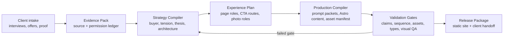

# AURA Compiler Operating Model

## Decision

AURA is being redesigned as a **premium personal-brand site compiler**. Its input is not “a client name and a theme.” Its input is a controlled client evidence pack: buyer context, commercial tension, offers, permissioned proof, visual direction, and conversion intent. Its output is a validated, inspectable, production-ready Astro release.

> **The engine does not generate a website from a prompt. It compiles an approved strategic position into a site whose claims, pages, assets, forms, and visual language can be traced to the client pack.**

This approach preserves expert judgment where it matters while making production repeatable. A future client-facing Studio can use the same data contracts, but no Studio UI is required for the Compiler to deliver high-end sites today.

## 1. The engine in one view



The deterministic compiler never fabricates strategic inputs. An AI model may help extract, compare, draft or propose—but cannot move a claim into a public output without a human-approved evidence status.

## 2. Four engine layers

| Layer | Purpose | Primary artifact | Deterministic responsibility | Human responsibility |
|---|---|---|---|---|
| **01. Evidence Foundation** | Establish what is true, permissioned and commercially relevant. | `client-brief.yaml`, `evidence-register.yaml`, offer inventory | Validate IDs, sources, permission status and required discovery fields. | Approve source facts, permission and risk disclosures. |
| **02. Strategy Compiler** | Select the right architecture, visual world and conversion motion. | `strategy.yaml`, `page-plan.yaml` | Reject architecture / CTA / claim mismatches and missing persuasion roles. | Choose buyer, tension, thesis, offer priority and architecture. |
| **03. Production Compiler** | Turn approved strategy into implementation-ready content, prompts and assets. | Prompt packets, typed AURA content, photo shotlist, asset manifest | Generate deterministic skeletons, validate schema and preserve claim references. | Approve copy, image selections, page composition and voice. |
| **04. Release Compiler** | Prove that the release works in the browser and is safe to publish. | QA report, static build, release manifest | Run content, image, type, accessibility, responsive and build checks. | Final publish decision, legal review and endpoint activation. |

## 3. The client pack is the source of truth

Every client lives in a portable `clients/<slug>/` directory. The pack can be copied, reviewed, versioned and later stored in a database without changing its logical model.

```text
clients/<slug>/
├── 00-intake/
│   ├── client-brief.yaml          # buyer, tension, position, offers, conversion
│   ├── evidence-register.yaml     # every public claim and permission state
│   ├── voice-and-constraints.yaml # language, compliance, exclusions
│   └── sources/                   # private source documents; never published
├── 01-strategy/
│   ├── strategy.yaml              # approved architecture and visual direction
│   ├── page-plan.yaml             # pages, persuasion roles, CTA routes, claim refs
│   └── decision-log.md            # what was chosen, rejected and why
├── 02-assets/
│   ├── photo-shotlist.yaml        # identity/consent, role, prompt and crop plan
│   ├── asset-manifest.yaml        # published derivative inventory and alt text
│   ├── masters/                   # local-only source photography / approved originals
│   └── generated/                 # inspectable concept or AI source output
├── 03-production/
│   ├── prompts/                   # deterministic prompt packets from approved inputs
│   ├── astro-content/             # brand, pages, posts and case-study records
│   └── component-plan.yaml        # selected blocks and composition notes
└── 04-release/
    ├── validation-report.json
    ├── visual-qa-report.json
    ├── release-manifest.json
    └── handoff.md
```

The first three directories are **input and approval spaces**. The last two are compiler outputs. A future Studio can manage approvals in a user interface but must never bypass these contracts.

## 4. Contracts that must exist above the current AURA schema

The existing `brand`, `pages`, `caseStudies`, and `posts` collections remain the final Astro rendering layer. The Compiler adds strategy and truth layers above them.

| Contract | Why it is separate from current AURA content | Required fields |
|---|---|---|
| **Client Brief** | A brand record is too late and too mixed to make core commercial decisions. | Buyer, high-stakes moment, private tension, one-sentence position, thesis, offer, conversion action, visual world. |
| **Evidence Register** | Existing proof arrays do not preserve source, permission, scope or placement. | Claim ID, exact wording, type, source, status, permission owner, timeframe, scope, caveat, allowed placement. |
| **Strategy Record** | Existing archetypes only label pages; they do not select commercial architecture. | Selected architecture, rejected alternatives, rationale, page map, conversion routes, proof posture, theme / visual world. |
| **Page Plan** | Current page JSON specifies blocks but not the visitor state or strategy that requires them. | Visitor, decision, primary CTA, section role, state transition, claim IDs, photo roles, block candidates. |
| **Photo Shotlist** | Current image objects lack consent, narrative job, crop plan and generation provenance. | Image role, consent, source / concept state, wardrobe, setting, ratio, desktop/mobile crop, prompt packet, asset path. |
| **Release Manifest** | Current build output does not record why it is publishable. | Git revision, client pack version, all gate results, domains/endpoints enabled, approver, release time. |

## 5. Compiler stages

### Stage A — Initialize

`aura init-client --slug <slug>` creates a clean client pack, copies controlled templates and generates no public-facing client claims.

**Pass condition:** the pack exists and every discovery field is explicitly completed or marked unresolved.

### Stage B — Assess

`aura assess` reads the client brief and evidence ledger. It proposes the appropriate architecture only as a hypothesis, then produces a decision report that shows buyer clarity, tension, offer motion, evidence strength and unresolved questions.

**Pass condition:** one architecture is approved, at least one primary conversion action is named, and unresolved claims are not eligible for output.

### Stage C — Plan

`aura plan` compiles an approved strategy into a page plan. It maps visitor states to roles rather than blindly copying page sections. It recommends AURA blocks, assigns claim references, assigns a unique photography role to meaningful visual moments, and defines form intent.

**Pass condition:** every high-intent page has one primary action, the home follows the selected architecture’s persuasion spine, the mechanism precedes detailed offer pressure, and proof references only approved claims.

### Stage D — Prompt

`aura prompt` produces inspectable prompt packets for discovery extraction, positioning alternatives, page planning, block drafting, case study drafting, image art direction and QA. Every prompt includes its source claim IDs, the allowed scope and a hard prohibition on new facts.

**Pass condition:** prompts use approved strategy and contain no unknown public assertion as a supplied fact.

### Stage E — Compose

`aura compose` emits typed AURA content records and a component plan. It does not silently invent content. For any missing approved copy, it writes explicit `[NEEDS APPROVAL]` fields instead of a plausible replacement.

**Pass condition:** Astro schema validates, every used image is in the manifest, every evidence-bearing block resolves claim IDs, and form configuration is safe for the environment.

### Stage F — Assets

`aura assets` turns an approved photo shotlist into a generation / shoot packet, image manifest and responsive derivatives. It treats a real client’s identity reference as permissioned input. It labels a synthetic concept scene as a concept and never uses it to imply a real event or customer relationship.

**Pass condition:** image consent and source state are recorded; role, alt text, dimensions and desktop/mobile crops exist; only optimized outputs are published.

### Stage G — Verify and release

`aura verify` calls contract validation, page-sequence scoring, AURA block linting, image validation, type checks, static build, screenshot-based desktop/mobile QA and release-manifest creation.

**Pass condition:** no blocking error; no unresolved public claim; no broken asset or type failure; no layout overflow; exactly one H1 per page; no live data collection without an approved endpoint.

## 6. Command surface

The compiler will provide one coherent command set.

| Command | Input | Output | Does not do |
|---|---|---|---|
| `pnpm aura:init` | Slug and basic identity | Clean client pack | Choose a strategy or make claims |
| `pnpm aura:assess` | Client Brief + Evidence Register | Architecture recommendation and readiness report | Approve proof |
| `pnpm aura:plan` | Approved strategy | Page / CTA / block / photo role plan | Draft factual copy |
| `pnpm aura:prompts` | Strategy + page plan | Auditable AI prompt packets | Call an AI provider automatically |
| `pnpm aura:compose` | Approved structured production inputs | Typed AURA content skeleton | Invent missing source facts |
| `pnpm aura:assets` | Approved photo shotlist | Image manifest and derivative tasks | Imply synthetic images are real documentary proof |
| `pnpm aura:verify` | Full client pack + rendered content | Machine-readable validation report | Override a failed approval state |
| `pnpm aura:release` | Passing validation report | Release manifest / build-ready package | Publish a live endpoint without authorization |

The first engine version remains deliberately **file-driven and deterministic**. It has no background polling, no standing AI API cost, no opaque autonomous write path and no client-facing database. That makes it a correct core for immediate delivery and preserves a clean boundary for Studio later.

## 7. Architecture profiles

Each profile is a controlled configuration, not a general theme.

| Profile | Requires | Prefers | Avoids |
|---|---|---|---|
| `private-signal` | Buyer tension, method, qualified private CTA, confidentiality policy, cinematic photo roles | Artifact / working-scene proof and limited CTA cadence | Busy logo strips, social proof theater, generic cards |
| `authority-speaking` | Topic outcomes, stage / credential proof, booking process, event form | Speaker reel, topic cards, organizer proof | Generic contact form, media claims without context |
| `creator-education` | Offer ladder, free first result, maturity segmentation | Program routes, instructional proof, content capture | One opaque “work with me” CTA |
| `niche-specialist` | Specific vertical / buyer, cost of inaction, method, qualification fields | Assessment, case anatomy, operational proof | Broad audience language, unqualified service cards |
| `manifesto-movement` | Real category enemy, identity thesis, proof of relevance | Doctrine, story, community / application routes | Manufactured contrarianism |
| `portfolio-ip` | Central thesis, organized ventures / products, buyer paths | Timeline and owned-IP map | Unstructured celebrity collage |

## 8. Quality gates

| Gate | What is checked | Blocking condition |
|---|---|---|
| **Truth** | Claim ID, source, status, permission, timeframe and caveat | Public proof is pending, private, rejected or untraceable. |
| **Strategy** | Buyer, tension, thesis, architecture, offer and CTA | Generic audience, no decision, architecture mismatch or CTA sprawl. |
| **Sequence** | Visitor-state order and role dependencies | Detailed offer before mechanism / proof without explicit rationale. |
| **Assets** | Consent, role, provenance, dimensions, crop and alt text | Missing or broken asset, identity misuse, absent mobile crop or unknown provenance. |
| **Implementation** | Typed content, schema, form state, SEO and semantic headings | Schema / type error, missing H1, live form without endpoint configuration. |
| **Experience** | Desktop/mobile composition, overflow, contrast and interaction | Broken hierarchy, inaccessible control, unusable crop or visual regression. |
| **Release** | Build provenance and approved deployment values | Failed gate or unapproved domain / form activation. |

## 9. Studio-ready extension path

AURA Studio should not replace the Compiler. It should provide a friendly management layer over the same pack contracts.

| Future Studio module | Reads / writes | Why it can arrive later |
|---|---|---|
| Discovery portal | Client Brief | Compiler already makes the schema useful before a form UI exists. |
| Evidence approval desk | Evidence Register | Permission and claims rules are deterministic. |
| Strategy board | Strategy + Page Plan | Selection logic remains in the compiler, UI only exposes the decision. |
| Photo review board | Shotlist + Asset Manifest | A human can approve a frame without touching the image build pipeline. |
| Content review | Production content + claim refs | Copy revisions retain evidence traceability. |
| Release dashboard | Validation + Release manifests | Operators can see exactly which gate blocks publication. |

## 10. Minimum viable Compiler completion

The engine redesign is successful when a new client can move from an empty `clients/<slug>/` pack to a validated `03-production/astro-content/` release candidate using the command surface above; every public claim and every photographic asset can be traced back to an approved record; and the existing Astro site can render the generated pack without manual component assembly.
