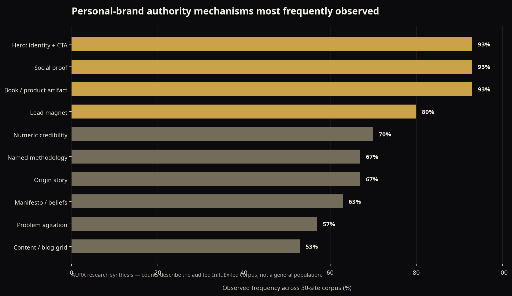

# AURA Research Findings: Personal-Brand Website Pattern Language

**Author:** Manus AI  
**Research basis:** Forensic review of 30 InfluEx-built personal-brand sites, including the 17 entries exposed by the consultant filter and 13 adjacent authority-led sites. The audited source corpus is anchored in InfluEx’s consultant portfolio and includes sites such as [Jenna Phillips Ballard][2], [Kathryn Janicek][3], [Vinh Giang][4], [Darren Frank][5], and [Karim Naoum][6]. [1]

## Executive finding

The best sites in the corpus are not “online brochures.” They are **authority systems**. Their pages make an initially unfamiliar expert legible in a repeatable order: first a sharply named audience tension, then evidence, then a mechanism, then a human story, and finally an appropriate next step. The visuals vary considerably, but this persuasion sequence is stable enough to productize.

| Audit dimension | Corpus finding | Product decision in AURA |
|---|---:|---|
| Homepage hero | 93% present an identity + promise + CTA above the fold | Every homepage begins with a dedicated Hero block family. |
| Proof | 70% use a numerical credibility stack; 93% use some form of social proof | Proof blocks are first-class and appear before detailed offers by default. |
| Mechanism | 67% present a named method | The content model includes named frameworks, pillar sets, process timelines, and principle sequences. |
| Origin story | 67% use an origin-story bridge | OriginStory and CrucibleMoment are reusable structural blocks rather than ad hoc prose. |
| Lead capture | 80% use a lead magnet | Capture blocks support an audit, toolkit, chapter, masterclass, quiz, or newsletter. |
| Technical stack | 22 of 30 sites used WordPress; 18 used Elementor | Astro static generation replaces page-builder runtime overhead with typed content and static HTML. |

> **Design conclusion:** Preserve the persuasion architecture. Replace the page-builder operating model.

## Pattern frequency visualization

The chart visualizes internal audit counts. It summarizes the particular reviewed corpus and should be used as a planning heuristic, not as an industry-wide benchmark.

## Methodology and scope

The review treated each site as a system, not a screenshot. For each accessible site, the audit recorded homepage section sequence, conversion routes, copy formula, proof devices, visual tokens, technology signals, photography direction, mobile behavior, and evident failure modes. “Frequency” refers to the 30-site research corpus unless otherwise specified. These are internal research counts, not industry-wide benchmarks.

The consultant list itself was obtained from InfluEx’s filtered portfolio page. The added sites were authority-led builds from adjacent portfolio categories because their personal-brand mechanics are directly comparable to consultant brands. [1]

| Scope element | Included | Excluded |
|---|---|---|
| Primary research unit | Public-facing personal-brand or founder-led website | Private member areas, checkout flow, CRM automation, paid advertising |
| Page focus | Homepage first, then about, offers, speaking, blog, and contact when available | Deep content inventory beyond the visible template system |
| Quality lens | Persuasion, clarity, reusability, performance signals, accessibility signals, photography | Client business outcomes or claims not independently verified |
| Technology lens | Visible framework and delivery clues | Source-code audits of sites not publicly exposed |

## The four archetypes

The system begins with **archetype selection** because it prevents a generic page stack from serving incompatible business models. The archetype determines conversion goal, proof order, number of offers, photo register, and the dominant CTA.

| Archetype | Observed count | What is being sold | Primary conversion | Recommended AURA start |
|---|---:|---|---|---|
| **Personal Authority Hub** | 17 | A person’s thinking across advisory, speaking, book, program, and media | Opt-in or call, then ascension | `HeroSplitPortrait → LogoStrip → Problem → Method → Proof → Offers → Capture` |
| **Firm With Figurehead** | 8 | A company made credible through a named founder or specialist | Consultation or case review | `HeroSplitPortrait → CredibilityBar → Services → Case Results → ContactSplit` |
| **Coach Transformation** | 3 | A personal identity or behavioral shift | Lead magnet, then program application | `HeroSplitOptin → EmpathyQuoteWall → FuturePacing → Method → Testimonials → Application` |
| **Single-Offer Funnel** | Edge case | One narrowly defined offer | One repeated conversion action | `Hero → Problem → Proof → Offer → FAQ → Final CTA` |

The guiding decision is simple: a founder with three distinct revenue lines needs a hub; a specialist selling one premium service needs a focused path. AURA encodes that difference in the `archetype` field of every page and brand file.

## The canonical persuasion spine

The corpus’s strongest homepages move from **attention** to **belief** to **action**. They do not use every element on every page, but they rarely reverse the logic. In particular, high-ticket pages establish the reason to trust before they ask for the purchase.

| Stage | Typical block types | Job it performs | Copy requirement |
|---|---|---|---|
| 1. Attention | HeroSplitPortrait, HeroCenteredStatement | Make the visitor recognize themselves and the stakes | State a narrow audience, tension, and specific future state. |
| 2. Borrowed authority | LogoStrip, MediaFeatures, AuthorityQuote | Reduce first-visit skepticism | Use only earned, attributable proof. |
| 3. Problem recognition | EmpathyQuoteWall, ProblemAgitation | Demonstrate situational fluency | Use language the audience would actually say. |
| 4. Cost and aspiration | CredibilityBar, FuturePacing, IconGrid | Make inaction concrete and change desirable | Prefer real consequences over abstract fear. |
| 5. Mechanism | MethodologyPillars, NumberedFramework, PrincipleZigZag | Explain why this approach is different | Name the method; make each step defensible. |
| 6. Evidence | ResultsGrid, TestimonialGrid, AssociationGrid | Convert claims into proof | Use named outcomes, before/after contrast, and permissioned attribution. |
| 7. Trust transfer | OriginStory, CrucibleMoment, Manifesto | Show motive and judgement | Tell one specific scene, not a chronological résumé. |
| 8. Offer and qualification | ServicesGrid, HighTicketOffer, AudienceQualifier | Let the right person self-select | State whom it is and is not for. |
| 9. Capture and close | LeadMagnet, FAQ, ApplicationForm, FinalCta | Lower friction and resolve objections | Repeat the one primary business goal, not a collection of unrelated asks. |

AURA’s `blockStage` registry and `lint:blocks` command formalize this sequence. They do not dictate strategy, but they surface obvious structural inversions: no proof on a high-intent offer page, a detailed offer preceding evidence, or no close block.

## Copy mechanics that recur

The best copy is specific in one of four ways: a concrete audience, an identifiable enemy, an observable outcome, or a named method. The same four mechanisms recur even where tone differs radically.

| Copy mechanic | What it does | Weak version | Stronger system version |
|---|---|---|---|
| Audience tension | Qualifies immediately | “I help leaders grow.” | “You have built the thing. The market still cannot explain why it matters.” |
| Named enemy | Creates a contrastive point of view | “Most branding is bad.” | “Exposure without evidence is not authority.” |
| Named mechanism | Makes judgement transferable | “My proven process.” | “The Quiet Authority Method: Position, Proof, Package, Platform.” |
| Specific proof | Makes claims falsifiable and memorable | “We deliver results.” | “From zero inbound to 14 qualified conversations per quarter.” |
| Crucible scene | Gives the method a human origin | “I have 20 years of experience.” | “He read the acquisition announcement, put the page down, and said: ‘They did not even know we existed.’” |

The AURA demo intentionally demonstrates the final three. The fictional Priya Raghavan site is not a claim set to reuse; it is a compositional model for how a real client’s verified proof should be organized.

## Visual pattern language

The corpus is visually diverse, yet several visual choices are sufficiently common to become safe defaults. Dark authority sites typically use an almost-black surface, warm white type, one metallic or jewel accent, tightly tracked all-caps utility labels, and a single high-contrast display type style. Editorial sites reverse the surface but preserve the same hierarchy.

| System token decision | Observed pattern | AURA implementation |
|---|---|---|
| Surface | 73% of sites use a dark hero or alternating dark band | `--surface`, `--surface-raised`, and `--surface-inverse` tokens; five full themes. |
| Accent | 60% use gold, amber, or bronze | `obsidian-gold` is the default authority theme; navy, cyan, red, and ivory themes are also shipped. |
| Type | Geometric sans authority and editorial serif elegance are the two families | Theme-level font variables and a controlled display scale. |
| Container | 1140px is the modal visible desktop width | Semantic `narrow`, `content`, `base`, `wide`, and `full` container sizes. |
| Spacing | 80px desktop vertical sections are common | Tokenized `tight`, `default`, and `loose` section padding. |
| Buttons | Hard-corner authority and pill-friendly modern styles dominate | Theme controls radius; CTA intent controls emphasis. |

The purpose is not to imitate the source sites. The purpose is to prevent every new personal brand from reverting to generic SaaS cards, interchangeable gradients, or page-builder default spacing.

## What the system deliberately fixes

The audit found strong persuasive work paired with repeated production weaknesses. AURA treats these as architecture problems rather than aesthetic cleanup.

| Recurring weakness | Why it matters | AURA response |
|---|---|---|
| Page-builder bloat | Delays first impression and weakens mobile delivery | Static Astro output with islands only where interaction is required. [7] |
| CTA sprawl | Forces the visitor to choose the site’s business model | A declared `primaryGoal`, CTA intents, and a block linter. |
| Non-reusable authoring | Makes each new client a bespoke rebuild | JSON content collections and a single dynamic route. [8] |
| No schema | Leaves clear expertise signals opaque to search systems | Automatic Person, Organization, WebPage, FAQPage, Service, and Article graph generation. [9] |
| Weak mobile portrait art direction | Crops a side-third hero into an empty or face-losing mobile frame | Mobile-specific image crop generation in `photos:build`. |
| Poor proof hygiene | Replaces results with vague superlatives | Result and testimonial schemas require author, quote, and encourage specific outcome fields. |

## Strategic use of the findings

AURA is most effective when it is paired with a discovery process that extracts actual evidence before the page is written. Do not begin with a color palette. Begin with the client’s top audience, the value at stake, the narrow point of view, the named mechanism, three proof stories, and one appropriate next action. The design system then makes those decisions visible, responsive, and maintainable.

## References

[1]: https://www.influex.com/portfolio/?portfolio_categories=consultant "InfluEx Consultant Portfolio"
[2]: https://jennaphillipsballard.com/ "Jenna Phillips Ballard"
[3]: https://kathrynjanicek.com/ "Kathryn Janicek"
[4]: https://www.vinhgiang.com/ "Vinh Giang"
[5]: https://darrenfrank.com/ "Darren Frank"
[6]: https://karimnaoum.com/ "Karim Naoum"
[7]: https://docs.astro.build/en/concepts/islands/ "Astro Islands Architecture"
[8]: https://docs.astro.build/en/guides/content-collections/ "Astro Content Collections"
[9]: https://schema.org/ "Schema.org"
